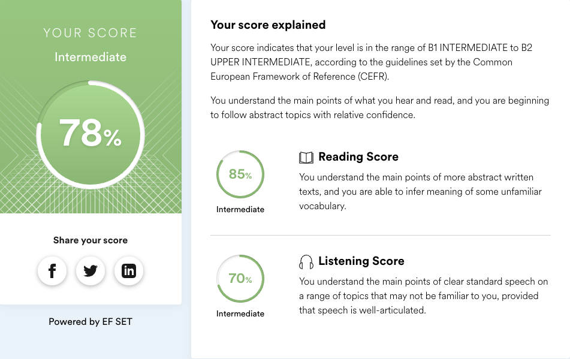

# Zhanybek Zhandos
### My Contact Info
   * Phone: [+7 776 422 22 01](tel:_77764222201 'call')
   * Email: [zh.zhanybek@gmail.com](mailto:zh.zhanybek@gmail.com 'mail')
   * Telegram: @Zhandaaa
   * [Linkedin](https://www.linkedin.com/in/zhandos-zhanybek-bb502a207/ 'linkedin')

### About me
I'm currently enhancing my frontend skills, specifically focusing on React at RSSchool. With two years of experience as a Bitrix programmer in a small firm, I am eager to completely switch to front-end development.
### Skills
   * HTML
   * CSS (Bootstrap, SASS/SCSS, BEM)
   * Git, GitHub
   * PHP
   * JavaScript (Fundamentals, ES6+, DOM, JSON, Asynchronous JavaScript)
   * React
   * VS Code, IntelliJ IDEA
   * Photoshop, Figma
### Code Examples
   *Function that takes an array of numbers and returns the sum of the numbers. If the array does not contain any numbers then returns 0.*

   ```
      const sum = (numbers) => numbers.reduce((acc, item) => acc + item, 0);
   ```
### Work Experience
   * 2015 - 2018 system administrator at TOO 'VK Sertik', Oskemen city;
   * 2018 - 2021 helpdesk service engineer at TOO '1C-Rating', Oskemen city;
   * 2021 - now bitrix programmer at TOO '1C-Rating', Oskemen city.
### Education
   * 2011 - 2015 East Kazakhstan Technical University, Computer science
   * hexlet.io courses
### English Language
   * Practicing at duolingo app
   * My level is Intermediate/Upper-intermediate (according to the online test at [www.efset.org](https://www.efset.org/)
   
   
